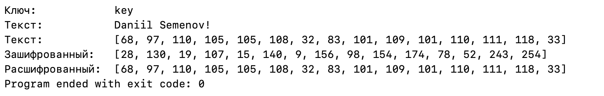

# Cipher

Реализация поточного шифра на языке Swift.

## About

Уникальный поточный шифр основанный на шифре RC4.

Стек технологий:
* S-блочное шифрование
* Генератор псевдослучайных чисел.
* Работа с байтами.

## How it work

> Вы можете использовать dataString и keyString для установки текста и ключа. (Данные переменные расположены в конце файла main.swift)

## Example

## Support

tg: @swissmer